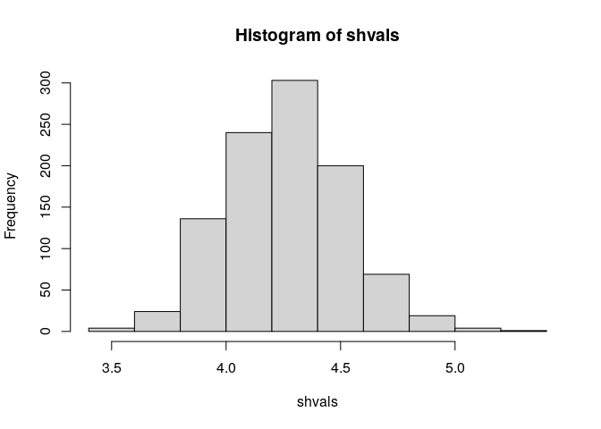

<!-- README.md is generated from README.Rmd. Please edit that file -->

# shinyshval

<!-- badges: start -->

[](https://CRAN.R-project.org/package=shinyshval)
[](https://github.com/basf/shinyshval/actions)
[](https://codecov.io/gh/basf/shinyshval?branch=master)
[](https://joss.theoj.org/papers/96403317a80cf275bba3413b5bb19775)
<!-- badges: end -->

The goal of `shinyshval` is to provide a user-friendly shiny-application
as interface to [SHVAL
tool](https://www.efsa.europa.eu/en/supporting/pub/en-623) developed by
EFSA. It computes shortcut values (SV) as an estimate for the expected
oral uptake of plant protection products residues by bees.

`shinyshval`

-   wraps original scripts `SHVAL_NoT_v1.1.R` and `SHVAL_TWA_v1.1.R`
    into functions & a package
-   provides sensible default parameters
-   adds a significant amount of tests to check for valid results
-   provides a user-friendly shiny application as interface.

## Demo

You can fire-up a demo application on binder:
[](https://mybinder.org/v2/gh/basf/shinyshval/binder?urlpath=shiny/inst/app/)

## Installation

You can install the app-package from github via

``` r
install.packages("remotes")
remotes::install_github("basf/shinyshval")
```

## Starting the app locally

Simply run

``` r
shinyshval::run_app()
```

## Using the backend

`shinyshval` tries to provide sensible default parameters for the
different scenarious. These have been extracted from the guideline as
good as possible (see `?default_estimates`). Especially for `RUD` values
users are welcome to adapt their needs.

We can compute shval values for default parameters of Honey Bee
foragers.

First we retrieve the defaults

``` r
# retrieve defaults
defaults <- shinyshval::default_estimates(species = "Honey Bee", 
                                          stadium = "larvae")
```

Than we estimate the parameters for the default inputs

``` r
param <- shinyshval::get_param(raw = NULL, est = defaults)
```

And finally we can simulate the SHVAL values

``` r
shvals <- shinyshval::sim(param)
```

These can than be summarized in different ways

``` r
hist(shvals)
```



``` r
# Mean
mean(shvals)
#> [1] 4.259501
# 95% CI
quantile(shvals, c(0.025, 0.975))
#>     2.5%    97.5% 
#> 3.786495 4.790376
```

## Quality assurance

In order to ensure consistent results between the `shinyshval` and
original EFSA SHVAL tool, the package is under version control and an
extensive set of tests have been implemented using `testthat`.

In short, a total number of 234 continuously integrated tests are run on
each code change. These tests that cover 100% of back-end functionality.

-   156 for the internal functioning of function for the app
-   42 tests comprise of 7 scenarios (6 each) specifically aimed at
    comparison of results with the original EFSA script
-   45 tests reproducing tables J4-J8 of the guideline

Because of the non-deterministic nature of the computations, comparisons
are made with a precision of

to
.
Reference results form the original script can be found in the
`inst/test_reference`for each scenario.

# Disclaimer

`shinyshval` is released with agreement of EFSA under
[EUPL-1.2](https://joinup.ec.europa.eu/collection/eupl/eupl-text-eupl-12)
open source license. According to articles 7 and 8 of the
[EUPL-1.2](https://joinup.ec.europa.eu/collection/eupl/eupl-text-eupl-12)
license EFSA is not responsible for errors, omissions or deficiencies
regarding `shinyshval`; `shinyshval` is being made available as such
without any warranty either expressed or implied, including, but not
limited to, warranties of performance, merchantability, and fitness for
a particular purpose; In no event shall EFSA be liable for direct,
indirect, special, incidental, or consequential damages resulting from
the use, misuse, or inability to use `shinyshval`.
