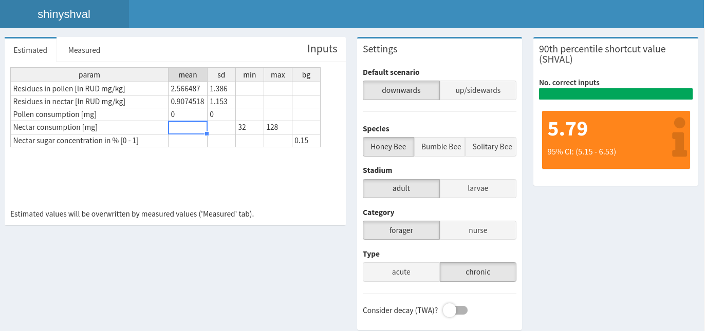

# Summary

In 2013 the European Food Safety Authority (EFSA) published a guidance document for the proposed revision of the bee risk assessment of plant protection products in the European Union [@efsa:2013]. 
This revision includes the introduction of the shortcut values (SV) as an estimate for the expected oral uptake of plant protection products residues by bees. 
To enable the users to modify the provided default input parameters and the re-calculation of the relevant SV, EFSA has published R-scripts for the calculations: the SHVAL tool [@shval:2014].

`shinyshval` refactors these R-scripts into an R package and adds quality measures like documentation & unit tests.
Additionally, it provides an easy to use graphical user interface to calculate SV values, using the Shiny web framework [@shiny:2021].
`shinyshval` provides simple and convenient access to core functionalities provided by the original SHVAL tool, without the need of the users to be familiar with the R programming language.

The aim of `shinyshval` is to facilitate accessibility of the SHVAL tool to all relevant users and provide a packaged, documented, tested and open-source set of functions. 


# Statement of need

The calculation of SV values and modification of its input parameters, depending on the expected exposure scenario, is a core component of the envisioned future bee Risk Assessment in the European Union. 
However, the EFSA provided SHVAL tool required familiarity with the R programming language and specific formatting of input data files.
By providing a web based graphical user interface, the `shinyshval` will facilitate the accessibility of the SHVAL tool to the wider community, enable future users without prior R knowledge to access this risk assessment calculation tool and could serve as inspiration for the development of the next generation of R based regulatory tools.


# Use

The `shinyshval` app closely follows the SHVAL tool implementation outlined in the associated technical report which provides a detailed explanation of the performed calculations and required input variables [@shval:2014].
Default parameters for different bee species and types have been defined (according to EFSA Guideline) and can be selected.
Help and description is directly included in the application.

The app can be started from R with the following code

```{r install, eval=FALSE}
# install shinyshval from github repository
install.packages("remotes")
remotes::install_github("basf/shinyshval")
# start app
shinyshval::run_app()
```

It can be also easily be deployed using docker [@rocker:2017].
A demo app using docker can be spin up on binder: https://mybinder.org/v2/gh/basf/shinyshval/binder?urlpath=shiny


```{r screenshot, echo = FALSE, out.width="100%", fig.cap="Screenshot of shinyshval. On the left parameters can be changed. In the middle default parameters be selected. The right side shows the computed shval."}

```

Of course the back-end functionality to compute SHVAL values in R without app is also possible and described in the README.

# Quality Assurance

Refactoring the initial interactive R scripts into an R package provides basic infrastructure for checking that the package is in full working order.

In order to ensure consistent results between the `shinyshval` and original EFSA SHVAL tool,
the package is under version control and an extensive set of tests have been implemented using `testthat` [@testthat:2011]. 

In short, a total number of 192 continuously integrated tests are run on each code change.
These tests that cover 100% of back-end functionality. 

* 156 for the internal functioning of function for the app
* 36 tests of 9 scenarios specifically aimed at comparison of results with the official EFSA script

Because of the non-deterministic nature of the computations, comparisons are made with a precision of $1x10^{-1}$ to $1x10^{-2}$.


# Availability and Community Guidelines

The software is available at the [GitHub repository](https://github.com/basf/shinyshval).
The GitHub repository also contains the source code for this paper and a contribution guide.

# Acknowledgement

We thank EFSA for supporting the authors publishing `shinyshval` under an open-source license.

# Disclaimer

`shinyshval` is released with agreement of EFSA under [EUPL-1.2](https://joinup.ec.europa.eu/collection/eupl/eupl-text-eupl-12) open source license.
According to articles 7 and 8 of the [EUPL-1.2](https://joinup.ec.europa.eu/collection/eupl/eupl-text-eupl-12) license EFSA is not responsible for errors, omissions or deficiencies regarding `shinyshval`;
`shinyshval` is being made available as such without any warranty either expressed or implied, including, but not limited to, warranties of performance, merchantability, and fitness for a particular purpose; 
In no event shall EFSA be liable for direct, indirect, special, incidental, or consequential damages resulting from the use, misuse, or inability to use `shinyshval`.

# References
